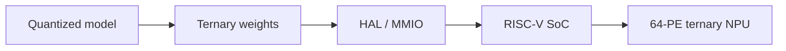

# Arthur Oliveira

### Edge AI × Computer Architecture

**Founder @ [Roko](https://rokoedge.com)** · Building efficient systems across the **model–hardware boundary**.

 

&nbsp;

&nbsp;

  

  <strong>TIME SERIES</strong>
  &nbsp;·&nbsp;
  EDGE INFERENCE
  &nbsp;·&nbsp;
  RISC-V
  &nbsp;·&nbsp;
  RTL / FPGA
  &nbsp;·&nbsp;
  EMBEDDED LINUX

 

## From signal to silicon

I work where **models become systems**.

At **[Roko](https://rokoedge.com)**, I work on time-series engineering and industrial telemetry — understanding the signal, establishing strong baselines, and increasing complexity only when the evidence and deployment constraints justify it.

On the systems side, I work with **RISC-V, RTL, FPGA acceleration and embedded Linux**, with a focus on efficient inference under real constraints: latency, memory, compute and energy.

 

## Selected work

### [TernaryEdge-RV](https://github.com/arthur-og/TernaryEdge-RV)

**Full-stack multiplierless Edge AI accelerator**

Hardware–software co-design for a **ternary Neural Processing Unit** integrated with a Linux-capable **RISC-V SoC**.

My work focuses on **hardware architecture, RTL and SoC design**: the canonical design integrates a **64-PE ternary datapath**, reduction tree, Wishbone interfaces, LiteX SoC integration and host-side hardware verification.

`Verilog` · `RISC-V` · `LiteX` · `Wishbone` · `FPGA` · `Yosys` · `Verilator`

Host-side RTL regression, Verilator lint and generic Yosys synthesis/check are validated. Physical FPGA deployment and runtime measurements remain separate validation stages.

 

<table>
<tr>
<td width="50%" valign="top">

<h3>
  <a href="https://github.com/arthur-og/risk_V32b">
    RISC-V 32-bit Pipeline
  </a>
</h3>

<strong>Processor architecture from the ground up</strong>

A pipelined 32-bit RISC-V processor built in Logisim Evolution, exploring datapaths, control logic and early resolution of branches, JAL and JALR.

<code>RISC-V</code>
<code>CPU Design</code>
<code>Digital Logic</code>

</td>

<td width="50%" valign="top">

<h3>
  <a href="https://github.com/arthur-og/practical-algorithms-c">
    Practical Algorithms in C
  </a>
</h3>

<strong>Algorithms & data structures at a lower level</strong>

Implementations of fundamental algorithms and data structures focused on clear C, computational fundamentals and explicit control over execution.

<code>C</code>
<code>Algorithms</code>
<code>Data Structures</code>

</td>
</tr>
</table>

 

## Building Roko

**[Roko](https://rokoedge.com)** is focused on engineering for time-series and edge systems.

The approach is evidence-driven: understand what the signal actually contains, establish a credible baseline, compare alternatives, validate the result, and only then choose the deployment architecture.

 

  <strong>
    understand the signal
    &nbsp;→&nbsp;
    baseline
    &nbsp;→&nbsp;
    compare
    &nbsp;→&nbsp;
    validate
    &nbsp;→&nbsp;
    deploy
  </strong>

  <a href="https://rokoedge.com"><strong>rokoedge.com →</strong></a>

 

## Toolchain

  
  &nbsp;&nbsp;&nbsp;
  
  &nbsp;&nbsp;&nbsp;
  
  &nbsp;&nbsp;&nbsp;
  
  &nbsp;&nbsp;&nbsp;
  
  &nbsp;&nbsp;&nbsp;
  

  <code>Verilog</code>
  &nbsp;·&nbsp;
  <code>RISC-V</code>
  &nbsp;·&nbsp;
  <code>LiteX</code>
  &nbsp;·&nbsp;
  <code>Yosys</code>
  &nbsp;·&nbsp;
  <code>Verilator</code>
  &nbsp;·&nbsp;
  <code>Nix</code>

